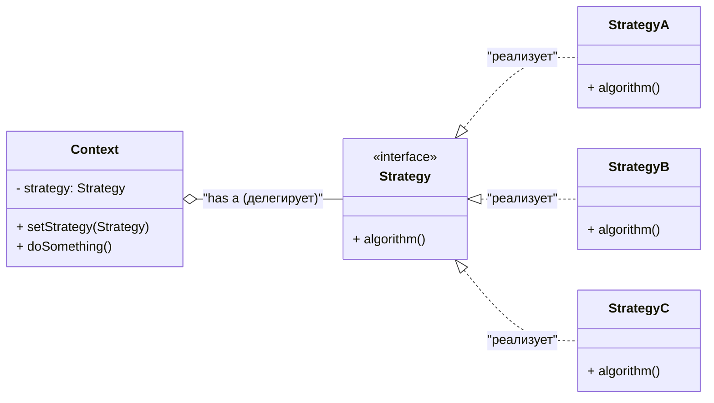

# Strategy (Стратегия)

> *Поведенческий паттерн, который определяет семейство алгоритмов, инкапсулирует каждый из них и делает их взаимозаменяемыми. Стратегия позволяет изменять алгоритм независимо от клиентов, которые его используют.*

---

## 📖 Описание

Паттерн Strategy рекомендует выделять алгоритмы в отдельные классы (стратегии) и делать их взаимозаменяемыми через общий интерфейс. Клиент (контекст) хранит ссылку на стратегию и делегирует ей выполнение задачи. Это позволяет легко менять поведение объекта во время выполнения программы, не изменяя его код.

**Суть паттерна:** "Отдели изменяющуюся часть алгоритма от остального кода".

---

## 🎯 Когда использовать

- Когда есть множество похожих алгоритмов, которые отличаются только способом выполнения
- Когда нужно избежать условных операторов (`if-else` или `switch-case`) для выбора алгоритма
- Когда алгоритмы должны быть взаимозаменяемыми во время выполнения
- Когда нужно изолировать сложность алгоритмов от клиентского кода
- Когда добавление нового алгоритма не должно требовать изменения существующих классов

---

## 🧩 Структура паттерна

**Участники:**
- **Strategy** — интерфейс, общий для всех алгоритмов
- **ConcreteStrategy** — конкретные реализации алгоритмов
- **Context** — класс, который использует стратегию
- **Client** — код, который выбирает и подставляет нужную стратегию

---

## 🔍 Проблема (before/)

В папке `before/` показан код **ДО** применения паттерна.

**Какая проблема здесь есть?**

Представь, что у нас есть приложение для расчета стоимости доставки. В зависимости от способа доставки (обычная, экспресс, международная) нужно применять разные алгоритмы расчета:

- ❌ Жесткая связанность — логика всех способов доставки внутри одного класса
- ❌ Нарушение принципа открытости/закрытости (OCP) — чтобы добавить новый способ, нужно менять существующий класс
- ❌ Сложно тестировать — нельзя изолированно проверить каждый алгоритм
- ❌ Код раздувается условными операторами
- ❌ Нельзя поменять алгоритм во время выполнения

---

## ✅ Решение (after/)
В папке `after/` показан код **ПОСЛЕ** применения паттерна.

**Как паттерн решает проблему:**

- ✅ Каждый алгоритм вынесен в отдельный класс (стратегию)
- ✅ Все стратегии реализуют общий интерфейс
- ✅ Контекст (ShippingCalculator) работает с интерфейсом, а не с конкретными классами
- ✅ Легко добавлять новые стратегии без изменения существующего кода
- ✅ Стратегии можно менять во время выполнения
- ✅ Каждая стратегия легко тестируется изолированно

## 🏆 Итог
Паттерн **Strategy** — это идеальный способ избавиться от условных операторов и сделать код гибким и расширяемым. 
Он позволяет:

Выделить алгоритмы в отдельные классы
- Менять их во время выполнения
- Добавлять новые без изменения существующего кода
- Тестировать каждый алгоритм изолированно
- Используй его, когда у тебя есть множество способов выполнить одно действие, 
и ты хочешь сделать код чистым и поддерживаемым!